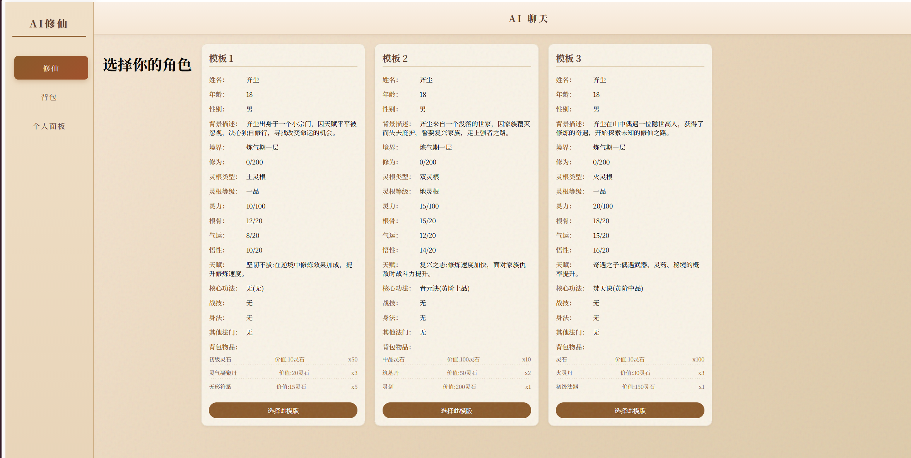
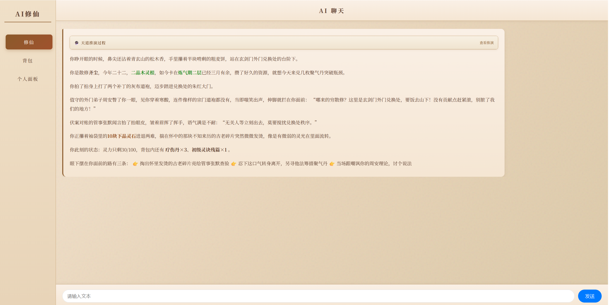
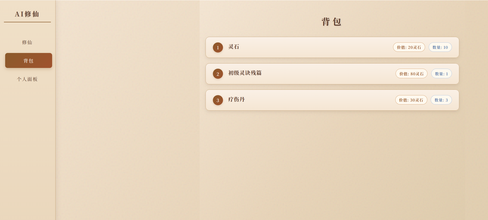
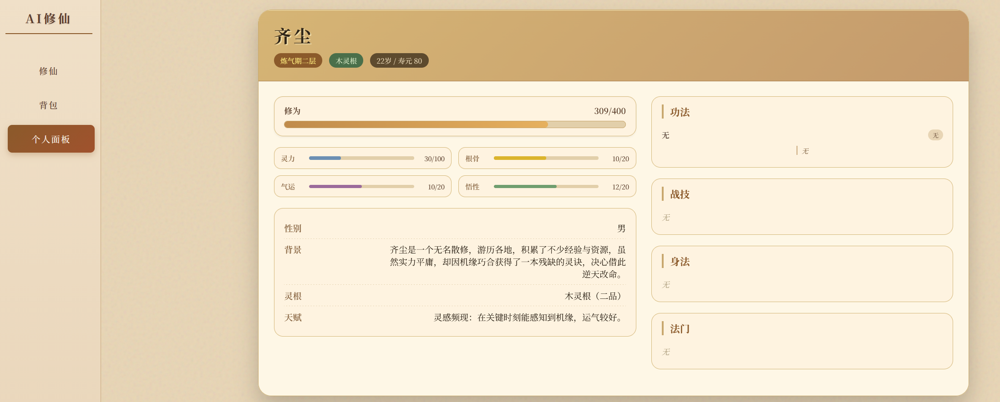

🧙 修仙模拟器 · AI 驱动的动态文字游戏

    基于大语言模型 + RAG 向量检索的修仙世界模拟器。玩家通过自然语言与 AI 互动，AI 实时生成剧情、物品、NPC，并同步更新背包与面板，实现接近“无限剧情”的沉浸式体验。

https://img.shields.io/github/stars/rongyan-123/Ai-xiuxian
https://img.shields.io/badge/license-MIT-blue.svg
📸 演示截图

  

🎯 项目简介

    玩法：你扮演一名修仙者，用自然语言指挥角色行动（如“去坊市买筑基丹”、“我要修炼”），AI 会根据当前剧情、背包、面板实时生成后续发展。

    动态世界：剧情、物品、NPC 均由 AI 按世界观自动生成，每次游戏体验独一无二。

    记忆与状态：角色属性、背包、剧情进度、世界地图、NPC 关系都会持久化，且随游戏进程动态演化。

🛠 技术栈（核心亮点）
分类 技术
前端 Vue 3 + Pinia + Vue Router + SSE 流式渲染
后端 Node.js + Express + better-sqlite3（迁移中）
AI & RAG 豆包大模型 API、ChromaDB、ONNX 本地 embedding（Xenova bge-small）
实时通信 SSE 进度推送 + 最终回复流式输出
部署 PM2 + Nginx + Docker（ChromaDB）
✨ 核心功能

    ✅ 自然语言交互：你说什么，AI 就回应什么，完全自由。

    ✅ 五层叙事引擎：意图识别 → 剧情生成 → 细节生成 → 因果推演 → 执行，保证剧情逻辑连贯。

    ✅ RAG 知识库：修仙设定（境界、法宝、丹药等）向量化，AI 回答准确，减少幻觉。

    ✅ 动态实体生成：AI 可根据剧情自动生成新物品、人物、地点，并存入向量库，后续剧情可复用。

    ✅ 实时进度反馈：后端通过 SSE 推送“正在生成剧情…”、“正在创造物品…”等进度，前端增量显示。

    ✅ 状态机持久化：玩家地点、剧情阶段、好友/敌人列表等保存为 JSON，后续对话可读取。

    ✅ 流式输出：最终回复一个字一个字打出，打字机效果，降低等待焦虑。

🚀 快速开始（本地运行）
环境要求

    Node.js 18+

    npm / yarn

    Docker（用于 ChromaDB，可选但推荐）

    （可选）Git LFS（用于下载 embedding 模型）

1. 克隆仓库
   bash

git clone https://github.com/rongyan-123/Ai-xiuxian.git
cd Ai-xiuxian

2. 安装依赖
   bash

# 前端

cd frontend # 如果前端在 frontend 文件夹，否则直接在根目录
npm install

# 后端

cd ../server
npm install

3. 配置环境变量

在 server 目录下创建 .env 文件，填入你的 API Key：
text

API_KEY=你的豆包/OpenAI Key
LLM=doubao-seed-2-0-pro # 或其他模型名

    ⚠️ 注意：不要提交 .env 文件，项目已配置 .gitignore。

4. 启动 ChromaDB（向量数据库）
   bash

docker run -d -p 1111:8000 -v ./chroma_data:/chroma/chroma --name chroma-rag chromadb/chroma

如果不想用 Docker，也可以直接 pip install chromadb 并运行，但不推荐。 5. 导入世界观数据（首次运行）
bash

cd server
node seed-chroma.js

这会读取 StaticData/AllData.json 中的修仙设定，向量化后存入 ChromaDB。 6. 启动后端服务
bash

node server.js

# 或使用 nodemon 开发模式

npm run dev

7. 启动前端
   bash

cd frontend
npm run serve

访问 http://localhost:8080 开始游戏。
📁 项目结构（简略）
text

Ai-xiuxian/
├── frontend/ # Vue 3 前端
│ ├── src/
│ │ ├── components/ # 聊天、背包、面板等组件
│ │ ├── stores/ # Pinia 状态管理
│ │ ├── pages/ # 路由页面
│ │ └── main.js
│ └── package.json
├── server/ # Node.js 后端
│ ├── store/ # JSON 数据文件（背包、面板、状态机等）
│ ├── utils/ # ai.js, aitools.js, fs.js
│ ├── seed-chroma.js # 向量数据库种子脚本
│ ├── server.js # Express 入口
│ └── package.json
├── docker-compose.yml # （可选）ChromaDB 容器配置
└── README.md

🧠 架构设计亮点
五层叙事管线

    第一层（查询层）：意图识别 + RAG 检索，获取相关世界观、背包、面板数据。

    第二层（叙事规划层）：调用 Generate_Plot 生成剧情框架（起承转合）。

    第三层（细节生成层）：根据剧情生成新物品、人物、地点，存入向量数据库。

    第四层（因果推演层）：综合所有信息，推演行为结果，生成自然语言回复（内含选项）。

    第五层（执行层）：解析第四层回复，调用具体工具修改背包、面板、状态机。

RAG 落地细节

    使用 Xenova/bge-small-zh-v1.5 本地 ONNX 模型，避免网络依赖。

    所有世界观条目按 id、type、detailed_description 结构化，并向量化存入 ChromaDB。

    查询时先向量化用户问题，检索 Top‑3 最相关文档，拼接到提示词中。

状态机与持久化

    user_StateMachina.json 存储当前地点、剧情框架、当前剧情阶段（起/承/转/合）、好友/敌人列表等。

    每次生成剧情后，通过 ChangePlot 更新内存对象并写回文件，保证后续层能读取最新剧情。

📈 性能优化记录

    五层合并：将第二、三层合并为一次 API 调用，第四、五层合并，总请求次数减少 40%，延迟从 39s 降至 15s。

    流式输出：第五层最终回复启用 stream: true，前端逐字渲染，感知延迟降低 50% 以上。

    SSE 进度推送：后端在各层开始时推送状态（“正在生成剧情…”），前端实时显示，避免用户焦虑。

    本地模型缓存：embedding 模型首次加载后缓存，后续复用。

📄 开源协议

MIT License
🙏 致谢

    豆包大模型提供 API 支持

    ChromaDB 团队

    Hugging Face 社区（Xenova 模型）
